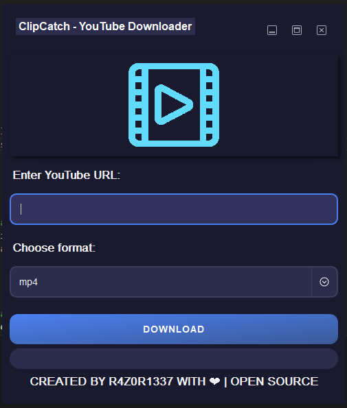

# 🎥 ClipCatch

**ClipCatch** is an open-source YouTube downloader built with **Electron** and **Node.js**. This desktop app allows you to easily download videos and audio from YouTube in multiple formats, including **MP4** and **MP3**. Perfect for anyone looking to access YouTube content offline!

## 🚀 Features

- 📹 **Download YouTube videos** in high quality (MP4)
- 🎵 **Extract audio** from YouTube videos (MP3)
- 🖥️ Simple and user-friendly interface
- ⚡ Fast and efficient downloads
- 🛠 Open-source and free to use
- ✨ Cross-platform support: Works on Windows, Mac, and Linux

## 📦 Installation

### Prerequisites

Ensure you have the following installed:

- [Node.js](https://nodejs.org/)
- [Git](https://git-scm.com/)

### Clone the Repository

```bash
git clone https://github.com/R4Z0R-1111/ClipCatch.git
cd clipcatch
```

### Install Dependencies

```bash
npm install
```

### Run the Application

```bash
npm start
```

### Build for Production

To package the app for production, you can use:

```bash
npm run build
```

This will create an executable for your operating system.

## 🛠️ Usage

1. Launch the app.
2. Enter the YouTube URL in the input field.
3. Choose the format (MP4 or MP3).
4. Click **Download** and track the progress with the built-in progress bar.

## Screenshots



## 🤝 Contributing

Contributions are welcome! If you have any improvements or feature requests, feel free to:

1. Fork the repository.
2. Create a new branch.
3. Submit a pull request.

## 🔧 Technologies Used

- **Electron** for cross-platform desktop app development.
- **Node.js** for backend processing.
- **youtube-dl-exec** for video/audio downloads.

## 📝 License

This project is licensed under the MIT License.

---

### 🌟 Acknowledgments

- Special thanks to the open-source community for the amazing tools that made this project possible.
- Based on **youtube-dl** and **Electron**.

---

Feel free to explore, fork, or contribute to this project! If you like it, don't forget to give it a star ⭐.
