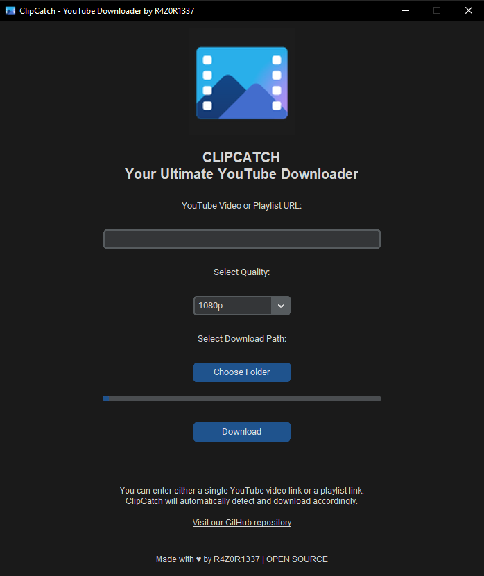

# 🎥 ClipCatch

**ClipCatch** is an open-source YouTube downloader built with **Python** and **CustomTkinter**. This desktop app allows you to easily download videos and audio from YouTube in multiple formats, including **MP4** and **MP3**, all while offering a sleek and intuitive user interface.

## 🚀 Features

- 📹 **Download YouTube videos** in high quality (MP4)
- 🎵 **Extract audio** from YouTube videos (MP3)
- 🖥️ Modern and user-friendly interface built with **CustomTkinter**
- ⚡ **Fast and efficient downloads** with real-time progress tracking
- 🛠 **Open-source** and free to use
- ✨ **Cross-platform support**: Works on Windows, Mac, and Linux
- 💾 **Save video/audio** directly to your preferred location

## 📦 Installation

### Prerequisites

Ensure you have the following installed:

- [Python 3.7+](https://www.python.org/)
- [Git](https://git-scm.com/)
- [FFmpeg](https://ffmpeg.org/download.html) (for audio extraction in MP3 format)

### Clone the Repository

```bash
git clone https://github.com/R4Z0R-1111/ClipCatch.git
cd clipcatch
```

### Install Dependencies

Use `pip` to install the required dependencies:

```bash
pip install -r requirements.txt
```

### Run the Application

```bash
python main.py
```

## 🛠️ Usage

1. Launch the app by running `main.py`.
2. Enter the YouTube URL in the input field.
3. Choose the format (MP4 or MP3) using the dropdown menu.
4. Click **Download** to start. You can track the progress via the built-in progress bar.
5. Save the video or audio to your chosen directory.

## Screenshots



## 🤝 Contributing

Contributions are welcome! If you want to improve ClipCatch or add new features, follow these steps:

1. Fork the repository.
2. Create a new branch for your feature.
3. Submit a pull request when ready.

## 🔧 Technologies Used

- **Python** for backend and core functionality
- **CustomTkinter** for the graphical user interface
- **yt-dlp** for YouTube video/audio downloads
- **FFmpeg** for audio extraction and format conversion

## 📝 License

This project is licensed under the MIT License.

---

### 🌟 Acknowledgments

- Special thanks to the open-source community for the incredible tools that made this project possible.
- Based on **yt-dlp**, **CustomTkinter**, and **FFmpeg**.

---

Feel free to explore, fork, or contribute to this project! If you like it, don't forget to give it a star ⭐.
